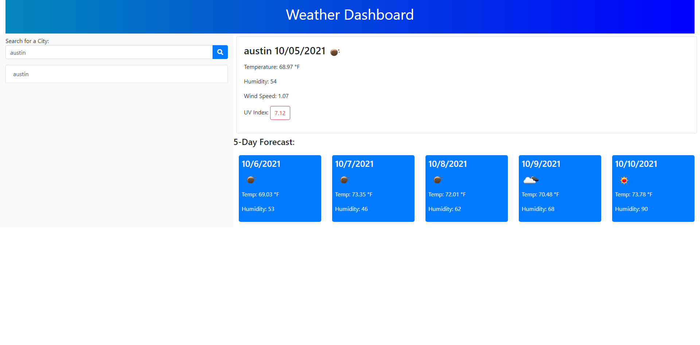

# Homework-5-Weather-Dashboard
  The objective of this project was to create a weather dashboard that showed the current date, temperature, humidity, uv index, and wind speed. Along with the currents days weather, the dashboard should also have a 5-day forecast that shows a date, weather icon, temperature, and humidity. 

##What was done in the homework--5
  The first thing done I did in the homework was create a saveHistory function that saved searched  cities to local storage for easier access in future weather searches. Next, i created functions to call the openweather api data. THe final thing i did was add classes and organize the data into its designated container. 
  
## ## Project Live Website
The weather dashboard can be found [here](https://kalvinn361.github.io/Weather-Dashboard/#)

